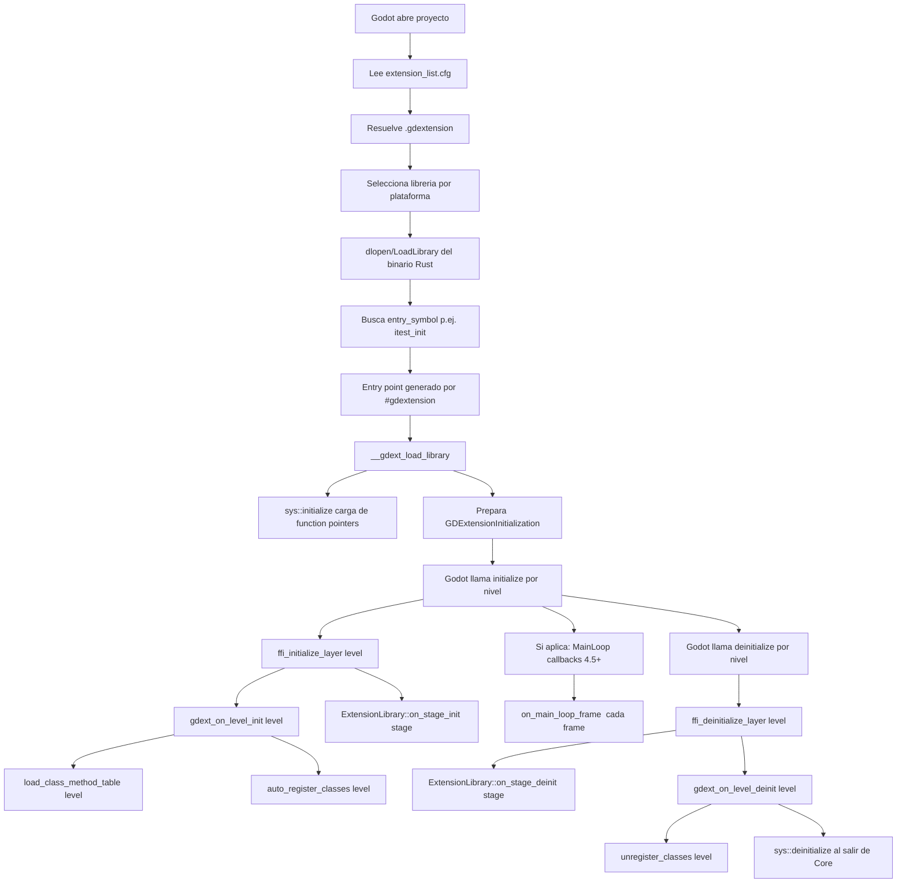

# godot-rust como GDExtension: registro, codegen, init y carga

Este documento resume **cómo godot-rust se registra como GDExtension**, **cómo genera el código de la API**, **cómo inicializa**, y **cómo incluye el binario Rust en el entorno de Godot**. Las conclusiones están basadas en el repositorio local `godot-rust`.

## 1) Registro como GDExtension (entrypoint y `.gdextension`)

### Archivo `.gdextension`
En los tests de integración hay un ejemplo mínimo en:

- `godot-rust/itest/godot/itest.gdextension`

Contiene:

```
[configuration]
entry_symbol = "itest_init"
compatibility_minimum = 4.2

[libraries]
linux.debug.x86_64 = "res://../../target/debug/libitest.so"
linux.release.x86_64 = "res://../../target/release/libitest.so"
windows.debug.x86_64 = "res://../../target/debug/itest.dll"
windows.release.x86_64 = "res://../../target/release/itest.dll"
macos.debug = "res://../../target/debug/libitest.dylib"
macos.release = "res://../../target/release/libitest.dylib"
macos.debug.arm64 = "res://../../target/debug/libitest.dylib"
macos.release.arm64 = "res://../../target/release/libitest.dylib"
```

Esto define:

- `entry_symbol`: el símbolo C que exporta la librería dinámica.
- `libraries`: rutas por plataforma/configuración al binario generado por Cargo.

Además, el proyecto Godot registra la extensión en:

- `godot-rust/itest/godot/.godot/extension_list.cfg`

con el contenido:

```
res://itest.gdextension
```

Godot usa este listado para cargar extensiones al abrir el proyecto.

### Procedimiento en Rust (macro `#[gdextension]`)
En `godot-rust/itest/rust/src/lib.rs`:

```
#[gdextension(entry_symbol = itest_init)]
unsafe impl ExtensionLibrary for framework::IntegrationTests { ... }
```

La macro `#[gdextension]` está en `godot-rust/godot-macros/src/gdextension.rs` y genera:

- Una función `extern "C"` con `#[no_mangle]` llamada `itest_init` (o `gdext_rust_init` por defecto).
- Esa función delega a `godot::init::__gdext_load_library::<T>()`, que crea la estructura `GDExtensionInitialization` requerida por Godot.

Esto conecta el `.gdextension` con la librería Rust: Godot llama `entry_symbol`, y el macro lo encamina al init común de godot-rust.

### Dependencias entre extensiones (variable de entorno)
En `godot-rust/godot-core/src/init/mod.rs` se documenta el uso de:

- `GODOT_RUST_MAIN_EXTENSION="MyExtension"`

Cuando una extensión depende de otras extensiones Rust, **solo la principal exporta el entrypoint** y registra clases. Las dependencias se compilan como `rlib` y se cargan indirectamente. La macro `#[gdextension]` omite generar el entrypoint si la variable indica que ese `ExtensionLibrary` no es el principal.

## 2) Inicialización y niveles de carga

La lógica principal de init está en:

- `godot-rust/godot-core/src/init/mod.rs`

Flujo clave:

1. El entrypoint generado por `#[gdextension]` llama a `__gdext_load_library`.
2. `__gdext_load_library` inicializa el FFI (carga de punteros de función) y prepara `GDExtensionInitialization`.
3. Godot invoca `initialize` y `deinitialize` por nivel (`Core → Servers → Scene → Editor → MainLoop`).
4. Para cada nivel, `gdext_on_level_init` ejecuta tareas internas (carga de tablas de métodos, registro de callbacks, etc.) y luego llama `registry::class::auto_register_classes(level)`.
5. Tras eso, `ExtensionLibrary::on_stage_init(stage)` permite hooks de usuario. En el ejemplo `itest` se usa para tests y callbacks de main loop.

Detalles relevantes:

- **Registro de clases**: `auto_register_classes(level)` registra automáticamente las clases anotadas con `#[derive(GodotClass)]` en el nivel adecuado.
- **Compatibilidad y seguridad**: hay checks por versión API, safeguards, y modo hot-reload en Linux.
- **MainLoop (4.5+)**: si la versión lo soporta, se registran callbacks de `startup/frame/shutdown` vía `GDExtensionMainLoopCallbacks`.

## 3) Cómo se genera el código de la API GDExtension

La generación de bindings se divide en varios crates y build scripts.

### a) FFI y header de GDExtension
- `godot-rust/godot-ffi/build.rs`

Pasos:

1. Obtiene `OUT_DIR` y crea `gdextension_interface.h` y `gdextension_interface.rs`.
2. Llama `godot_bindings::write_gdextension_headers(...)`.
3. Llama `godot_codegen::generate_sys_files(...)`.

Esto produce el **header C** y un **módulo Rust** con la interfaz GDExtension de Godot.

### b) Parseo del header para generar la interfaz Rust
- `godot-rust/godot-codegen/src/generator/extension_interface.rs`

Aquí se parsea `gdextension_interface.h` para extraer punteros de función (`GDExtensionInterface*`) y generar un struct `GDExtensionInterface` con sus campos y un loader basado en `get_proc_address`.

### c) JSON de la API de Godot (extension_api.json)
- `godot-rust/godot-codegen/src/models/json.rs`

`load_extension_api()` usa `godot_bindings::load_gdextension_json(...)` y deserializa el JSON en modelos Rust (clases, métodos, enums, etc.).

La fuente del JSON depende del feature:

- **Prebuilt** (default): usa JSON embebido por plataforma.
- **api-custom**: genera JSON invocando el binario de Godot local.
- **api-custom-json**: lee el JSON desde `GODOT4_GDEXTENSION_JSON`.

Esto está implementado en `godot-rust/godot-bindings/src/lib.rs` y `godot-rust/godot-bindings/src/godot_json.rs` / `godot_exe.rs`.

### d) Generación de clases y bindings
- `godot-rust/godot-codegen/src/lib.rs`

`generate_core_files()` y `generate_sys_files()` producen:

- Clases y estructuras nativas.
- Builtins y utilidades.
- Tablas y registros internos.
- Wrappers para el API de Godot.

El resultado se escribe en `OUT_DIR` y se usa en `godot-core` y `godot-ffi`.

## 4) Cómo se integra el binario Rust en el entorno de Godot

La integración real depende de tres piezas:

1. **El crate Rust compila como librería dinámica**:
   - `godot-rust/itest/rust/Cargo.toml`:
     ```
     [lib]
     crate-type = ["cdylib"]
     ```

2. **El archivo `.gdextension` apunta a los binarios de Cargo**:
   - `res://../../target/debug/libitest.so` (Linux)
   - `res://../../target/debug/itest.dll` (Windows)
   - `res://../../target/debug/libitest.dylib` (macOS)

3. **El proyecto Godot registra la extensión** en `extension_list.cfg`.

Cuando Godot abre el proyecto, lee la lista, resuelve el `.gdextension`, carga el `.so/.dll/.dylib` correspondiente a la plataforma, busca el símbolo `entry_symbol` y ejecuta la inicialización de godot-rust.

## 5) Resumen operacional

- El **registro** se hace via `.gdextension` + `entry_symbol` y la macro `#[gdextension]` que genera el entrypoint C.
- La **inicialización** vive en `godot-core/src/init/mod.rs` y ejecuta fases de Godot con hooks de usuario.
- El **codegen** se basa en `extension_api.json` + `gdextension_interface.h` y produce wrappers en `godot-core` y `godot-ffi`.
- La **carga en Godot** se concreta mediante `extension_list.cfg` y rutas a los binarios `cdylib` producidos por Cargo.

Si quieres, puedo ampliar este doc con ejemplos equivalentes en `godot-jvm` o hacer un diagrama de flujo del init.

----

## 6) Diagrama de flujo (carga y ciclo de vida)



## 7) Registro de clases (`GodotClass`) en detalle

El registro de clases se orquesta en `godot-core/src/init/mod.rs` y `godot-core/src/registry`.
El flujo es el siguiente:

1. El macro `#[derive(GodotClass)]` genera metadatos y registra la clase en el registro interno.
2. Al inicializar un nivel (`InitLevel`), se llama `gdext_on_level_init(level)`.
3. Dentro de ese método se ejecuta `registry::class::auto_register_classes(level)`.
4. Esa función recorre el registro interno y llama a los wrappers FFI para registrar clases en el `ClassDB` de Godot.

Puntos clave:

- El auto-registro evita listas manuales: basta con `#[derive(GodotClass)]` y el `#[gdextension]` en el `ExtensionLibrary`.
- El registro se alinea con el nivel de init para evitar acceder a APIs no disponibles todavía.
- El proceso es idempotente por nivel; hay control para evitar doble carga en hot reload o escenarios editoriales.

Archivos relevantes:

- `godot-rust/godot-core/src/init/mod.rs`
- `godot-rust/godot-core/src/registry/class.rs`
- `godot-rust/godot-core/src/registry/godot_register_wrappers.rs`
- `godot-rust/godot-macros` (macros `GodotClass`, `godot_api`, etc.)

## 8) Callbacks y hooks disponibles

Los hooks del usuario se definen en el trait `ExtensionLibrary` (ver `godot-core/src/init/mod.rs`).

Hooks principales:

- `min_level()`
  Controla el primer nivel de inicializacion. Por defecto es `InitLevel::Scene`.

- `on_stage_init(stage: InitStage)`
  Se llama para cada stage cargado (Core, Servers, Scene, Editor, MainLoop) en orden ascendente.

- `on_stage_deinit(stage: InitStage)`
  Se llama para cada stage descargado en orden inverso.

- `on_main_loop_frame()` (4.5+)
  Se llama cada frame, despues de los `Node::process()` y antes del `ScriptServer::frame()`.

Comportamiento relevante:

- Si un hook hace `panic`, godot-rust atrapa la excepción y reporta error, pero **no aborta** la carga.
- El orden exacto de disponibilidad de clases depende de Godot; el proyecto recomienda no asumir APIs fuera del nivel correspondiente.
- En editor, el comportamiento por defecto es `ToolClassesOnly` (ver `EditorRunBehavior`) para evitar que toda la lógica corra dentro del editor.

Ejemplo real en tests de integración:

- `godot-rust/itest/rust/src/lib.rs`

Allí se implementan:

- `min_level()` a `InitLevel::Core`.
- `on_stage_init` y `on_stage_deinit` para configurar tests.
- `on_main_loop_frame` cuando la API lo permite.

## 9) Como funcionan los callbacks sin reflexion (Rust)

La parte clave es que **no hay exploracion/reflexion en runtime**. El registro se hace con metadata generada en compilacion y almacenada en un registro estatico.

Mecanismo exacto:

1. Los macros como `#[derive(GodotClass)]` y `#[godot_api]` generan estructuras `PluginItem` y las insertan en un registro global.
2. Ese registro se crea con `plugin_registry!` y se llena usando `plugin_add!`, que coloca una funcion en una seccion de linkeo (`.init_array`, `__mod_init_func`, etc.) para ejecutar **antes del main**.
   - Implementacion: `godot-ffi/src/plugins.rs`.
3. En init (`gdext_on_level_init`), el motor llama `auto_register_classes(level)`.
4. `auto_register_classes` itera el registro global y arma un `ClassRegistrationInfo` por clase, con:
   - Punteros a callbacks C (`create`, `free`, `get_virtual`, `to_string`, `notification`, etc.).
   - Closures generadas para registrar metodos, propiedades y constantes.
5. Esos punteros se pasan a Godot via `classdb_register_extension_class*` y **Godot invoca luego los callbacks** en el momento oportuno.

Archivos relevantes:

- `godot-rust/godot-ffi/src/plugins.rs` (registro estatico sin reflexion).
- `godot-rust/godot-core/src/private.rs` (`plugin_registry!` y `iterate_plugins`).
- `godot-rust/godot-core/src/registry/class.rs` (`auto_register_classes` y `register_class_raw`).
- `godot-rust/godot-core/src/registry/callbacks.rs` (callbacks C que Godot llama).

Conclusiones:

- La "exploracion" ocurre en **build/link time**, no en runtime.
- Lo "deferred" es simplemente que Godot llama los callbacks cuando corresponde por nivel o evento, no porque se haya hecho introspeccion.

## 10) Comparacion con JVM (Java/Kotlin)

En `godot-java`, el flujo equivalente no usa reflexion en runtime. Se basa en:

1. **Bootstrap nativo** (`gdextension_init.c`):
   - Exporta `godot_java_bridge_init` (configurado en `gdjava.gdextension`).
   - Registra callbacks de niveles (`initialize_jvm` / `cleanup_jvm`) en `GDExtensionInitialization`.
2. **Puente JNI** (`jvm_bridge_runtime.c`):
   - Arranca la JVM en nivel SCENE.
   - Cachea `GodotBridge` y llama `GodotBridge.initialize(...)`.
   - En cada nivel, llama `GodotBridge.onInitializationLevel(level)` o `onDeinitializationLevel(level)`.
3. **Coordinacion Java**:
   - `GodotBridge` delega a `BridgeLifecycle`, que mantiene orden e idempotencia.
   - `BridgeContext` expone `ClassDBBridge` y `ScriptInstanceBridge`.
4. **Registro de clases** (propuesta y pipeline):
   - Ver `docs/auto-registration.md`: un task Gradle analiza bytecode (ASM) y genera `GeneratedRegistry.registerAll(...)` con referencias directas.
   - Esto evita `Class.forName` o reflection en runtime, y funciona para Java y Kotlin.

Archivos clave JVM:

- `godot-java/gdjava.gdextension`
- `godot-java/godot-extension-register/gdextension_init.c`
- `godot-java/godot-extension-register/jvm_bridge_runtime.c`
- `godot-java/godot-java-bridge/src/main/java/io/github/kingg22/godot/internal/initialization/GodotBridge.java`
- `godot-java/godot-java-bridge/src/main/java/io/github/kingg22/godot/internal/initialization/BridgeLifecycle.java`
- `godot-java/docs/auto-registration.md`

### Ejemplo equivalente (Java)

```java
// Clase de usuario
public final class Player extends GodotNode {
    public Player() {}
}

// Resultado esperado del registry generado (build-time)
public final class GeneratedRegistry {
    public static void registerAll(GodotRegistry registry) {
        registry.register(new ClassInfo(Player.class, "Node"));
    }
}
```

### Ejemplo equivalente (Kotlin)

```kotlin
class Player : GodotNode() {
    constructor() : super()
}

// El registry generado es identico porque se analiza bytecode, no el lenguaje fuente.
```

Comparacion directa:

- Rust: metadata se acumula en un registro estatico via macros + linker sections.
- JVM: metadata se genera en build-time via ASM y se llama desde `GodotBridge.initialize()`.
- En ambos casos, **sin reflexion en runtime**: el "descubrimiento" es build-time.

## 11) Como llegan los callbacks de clase a Rust (sin reflexion)

Cuando una clase se registra, `register_class_raw(...)` envia a Godot un `GDExtensionClassCreationInfo*` con punteros a funciones C.
Estas funciones C estan implementadas en `godot-core/src/registry/callbacks.rs` y funcionan como "trampolines":

- `create<T>` y `free<T>` crean/liberan la parte Rust.
- `get_virtual<T>` resuelve metodos virtuales y despacha a `T::__virtual_call(...)`.
- `to_string<T>`, `notification<T>` y setters/getters llaman codigo Rust generado.

No hay introspeccion:

- El tipo `T` esta fijado en compile-time por el macro.
- Los punteros se pasan una sola vez a Godot.
- Godot llama esos punteros cuando corresponda.

## 12) Cambio de comportamiento en editor y ToolClassesOnly

En Rust, `ExtensionLibrary::editor_run_behavior()` controla si el editor ejecuta callbacks de ciclo de vida:

- `ToolClassesOnly` (default): solo clases marcadas `#[class(tool)]` ejecutan callbacks en editor.
- `AllClasses`: todas las clases ejecutan callbacks en editor.

Implementacion:

- En `__gdext_load_library`, se crea `GdextConfig::new(tool_only_in_editor)`.
- `is_class_runtime(is_tool)` usa ese flag para marcar clases como **runtime-only** cuando no son tool y el editor esta activo.
- Resultado: en editor, Godot no dispara `_ready`, `_process`, etc. para clases no-tool, pero si permite invocarlas desde GDScript.

Archivos relevantes:

- `godot-rust/godot-core/src/init/mod.rs` (EditorRunBehavior y config).
- `godot-rust/godot-core/src/private.rs` (`is_class_runtime`).
- `godot-rust/godot-ffi/src/binding/single_threaded.rs` (`GdextConfig`).
